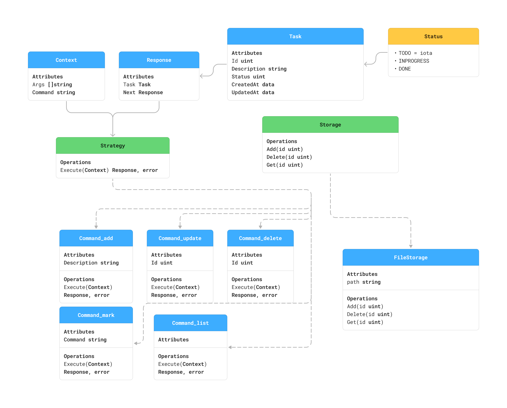

# cli-task-tracker
Task tracker is a project used to track and manage your tasks. In this task, you will build a simple command line interface (CLI) to track what you need to do, what you have done, and what you are currently working on.
```bash
go build -o task-cli .\src\main.go .\src\storage.go .\src\strategy.go

# Adding a new task
./task-cli add "Buy groceries"

# Updating and deleting tasks
./task-cli update 1 "Buy groceries and cook dinner"
./task-cli delete 1

# Marking a task as in progress or done
./task-cli mark 1 done
./task-cli mark 1 todo

# Listing all tasks
./task-cli list

# Listing tasks by status
./task-cli list --status done
./task-cli list --status=todo
./task-cli list -status inprogress
```
## Architecture
